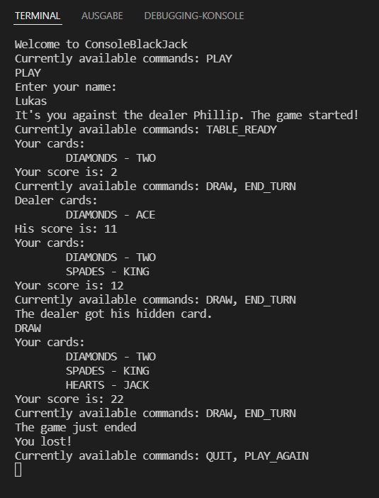
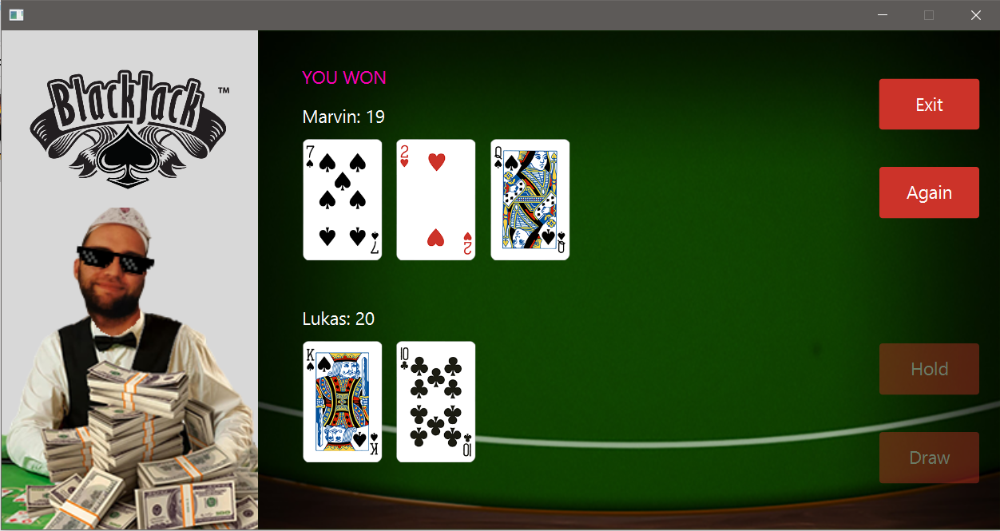
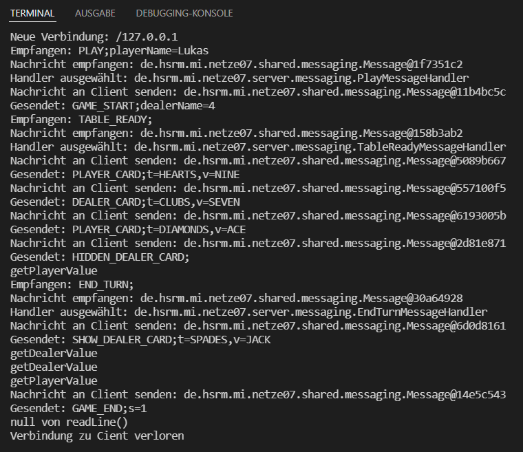
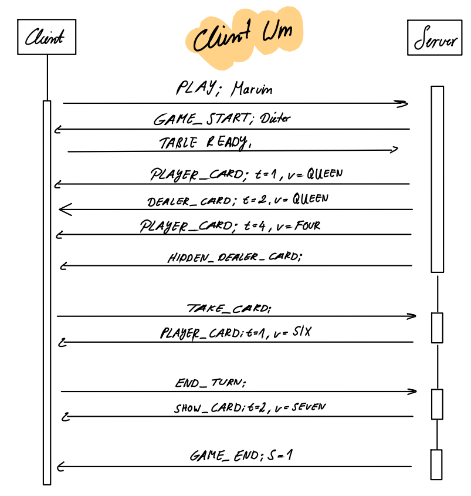
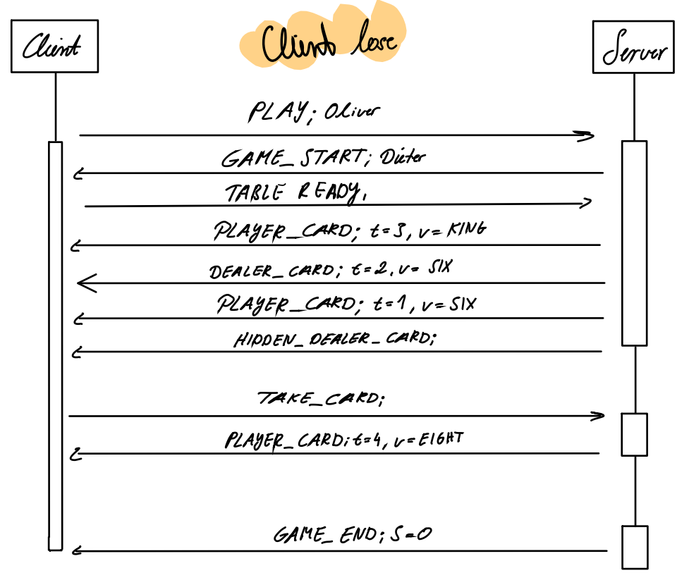
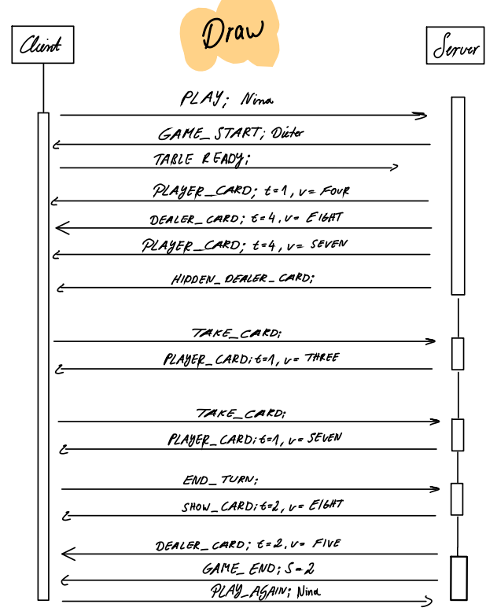
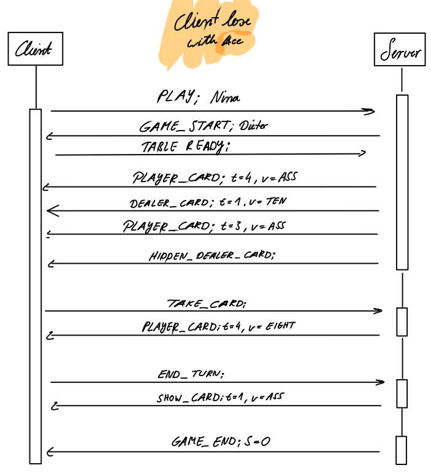
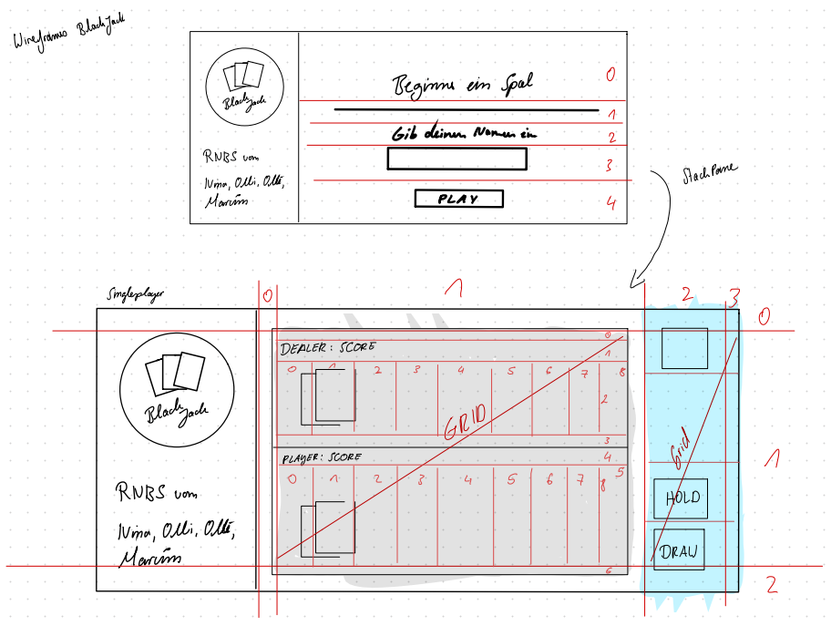

# Rechnernetze 🕸️ und Netzwerkprogrammierung 🌐


Uniprojekt Sommer Semester 2020

In diesem Projekt ging es darum, Netzwerkkommunikation zu verstehen und selbst anzuwenden, indem ein eigen erstelles Netzwerkprotokoll für eine Websocket basierte Client-Server-Kommunikation in einer Anwendung verwendet wird.

Als Anwendung sollte 🎰 **BlackJack** implementiert werden, ein 🃏 Karten-Glücksspiel, das in 💸 Spielbanken angeboten wird. Die Regel stehen [hier](https://de.wikipedia.org/wiki/Black_Jack#Die_Regeln).

♥️ ♣️ ♦️ ♠️

## Used Versions

 - JDK 12.0.2
 - Java 12
 - javafx-sdk-11.0.2

## RUN 🎲

Es gibt zwei Möglichkeiten, Blackjack zu spielen. Beide Varianten laufen, wie der Sinn des Projektes schon erahnen lässt, über einen **Server** und mehrere **Client**. Der Unterschied zwischen den beiden Spielmöglichkeiten liegt lediglich an zwei unterschiedlichen Clients. Der erste Client ein reihnes **Terminal Interface** und der zweite Client ist mit **JavaFX** gebaut.

### Terminal - Client 👨‍💻

Der Terminal Client gibt dem Nutzer immer Vorweg, was als nächstes für Züge möglich sind.



### JavaFX - Client 🕹️

#### ⚠️ Wichtig!
Für JavaFX module path zu den VM argumentshinzufügen:

Windows:
```
--module-path "D:\oliver\javafx-sdk-11.0.2\lib" --add-modules "javafx.controls,javafx.fxml"
```

MacOS:
```
--module-path /Users/marvin/Documents/Uni/javafx-sdk-11.0.2/lib --add-modules javafx.controls,javafx.fxml
```




### Server

Im Server sind noch einige ausgaben, über die man verfolgen kann, wenn sich neue Clients verbinden und wenn Spielzüge gemacht werden.



## Protokol

### sequenzdiagram_client_win


### sequenzdiagram_client_loose


### sequenzdiagram_client_draw


### sequenzdiagram_client_loose_ace


## Wireframes



